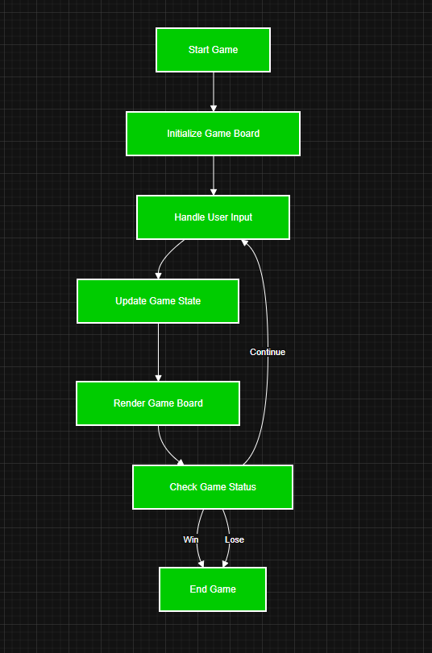
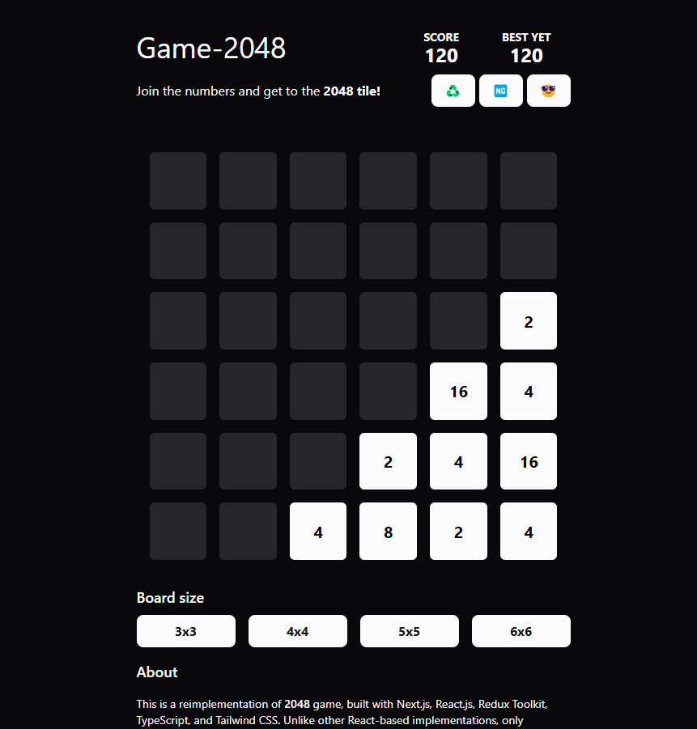

# Game 2048
- 
- This repository contains a reimplementation of the popular [2048 game](https://play2048.co/), built using modern web technologies.

## Workflow
- 

## Features

### Game 2048
- Built with **Next.js**, **React.js**, **Redux Toolkit**, **TypeScript**, and **Tailwind CSS**.
- Uses only functional components, avoiding canvas or element refs.
- Fully responsive and optimized for modern browsers.

## Prerequisites

### For the Game
1. **Node.js**: Install Node.js (v14 or higher recommended).
2. **npm or Yarn**: Ensure you have a package manager installed.

### For the Script
1. **Git**: Git must be installed and configured.

## Installation

1. Clone this repository:
   ```bash
   git clone https://github.com/ankurjaiswalofficial/game-2048.git
   cd game-2048
   ```

2. Install dependencies for the game:
   ```bash
   npm install
   ```

## Running the Game

1. Start the development server:
   ```bash
   npm run dev
   ```

2. Open your browser and navigate to `http://localhost:3000`.

3. To build the project for production:
   ```bash
   npm run build
   npm start
   ```
## Look -> (Themed)
- Dark
- 

- Light
- 
## Troubleshooting

- **Game Issues**: Ensure all dependencies are installed and the development server is running.

## License

This project is licensed under the MIT License. See the `LICENSE` file for details.

## Contributing

Feel free to submit issues or pull requests to improve the game or the script.

## Acknowledgments

- Developed by [Ankur Jaiswal](https://github.com/ankurjaiswalofficial).
- Source code available at [ankurjaiswalofficial/game-2048](https://github.com/ankurjaiswalofficial/game-2048).
